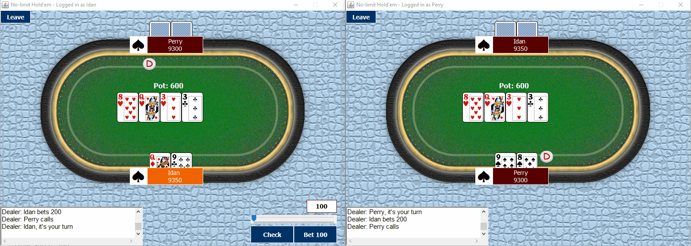

# PokerApp
This is a little project i did a while ago for the benefit of learning Java and practice.

- I made some improvements and included more features.
- Currently it mimics a texas-holdem poker game application played by 2 players on the same machine, since it doesn't support fully functional server-client communication yet. each window is representing a player from his point of view.

Here's a short animated gif to demonstrate what i'v done so far:

